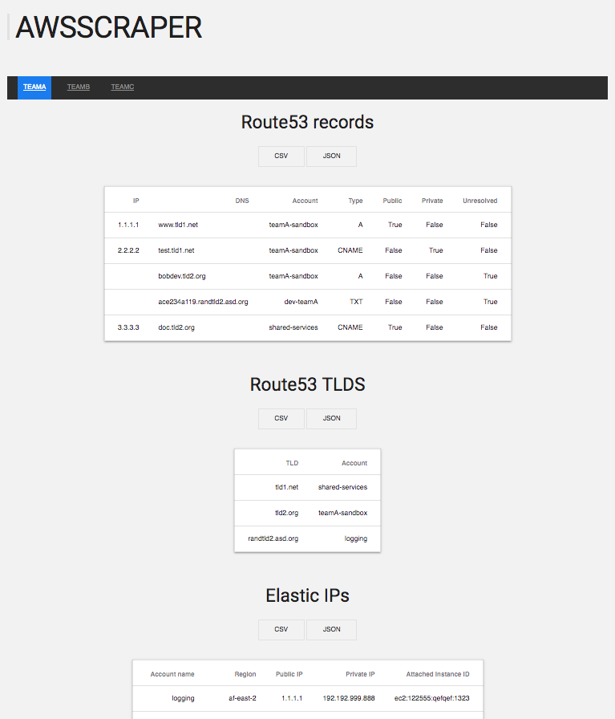

AWSSCRAPER
============
The easiest way to view all public endpoints within your AWS Accounts.

This tool supports
- AWS Route53, TLDs and EIPs
- Link between multiple teams and accounts
- Exporting csv or JSON
- API endpoints



## Usage (docker):
### Install Docker
Install docker (from the docker website- OS repos are usually old).

### Build Docker image
 `$ docker build -t awsscraper:latest . `

### Run Docker image
To run awsscraper, and expose the website on port 80 of 127.0.0.1:
 `$ aws-vault exec default -- ./run_docker.sh `
Make sure the aws-credentials used have the necessary creds to access the audit role..

## Usage:
### Install (for use or dev)
```
$ git clone <repo>
$ cd <repo>/awsscraper
$ pipenv install --three
```

### Commandline
- run `pipenv run ./dnsscraper.py` and pass in the account name (using aws-vault for aws credentials)

### Web
- run `pipenv run python routes.py`
- visit `127.0.0.1/test/`accountname

## Requirements:
- Python3
- Pipenv
- built in python libraries `socket` and `json`
- Audit role access- either a roles switch or a custom account with access

## TODO:
 - [x] add note on api endpoints on default page/footer
 - [x] Add full rest API (JSON results, not html)
 - [ ] refactor error handling in scrape_aws/processfunction to handle accounts independently
 - [ ] try/catches in routes.py
 - [ ] Improve web templates, and add JS sorting and filtering
